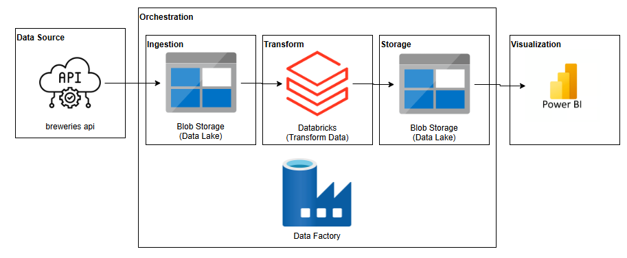

# ETL Data Engineering Project with Azure Cloud

## Overview

This project implements a complete ETL (Extract, Transform, Load) pipeline using the Azure cloud ecosystem. It processes data from an external API and organizes it into a structured Data Lake architecture with multiple layers (Bronze, Silver, Gold) for advanced analysis.

## Architecture

The pipeline leverages the following Azure services and frameworks:
- **Azure Data Factory**: Orchestrates and triggers the ETL workflow.
- **Azure Databricks**: Executes PySpark notebooks for scalable data transformations.
- **Azure Storage Account**: Hosts the Data Lake for storing raw, intermediate, and processed datasets across layers.
  
Below is the architecture diagram for this ETL project:

## Data Flow

### Data Source
- **Source**: Data ingested from the public API: [Open Brewery DB](https://api.openbrewerydb.org/breweries).
- **Format**: Initial raw data in JSON format.

### Data Layers
1. **Bronze Layer**:
   - Stores raw JSON data fetched from the API.
   - Serves as the immutable source for further transformations.

2. **Silver Layer**:
   - Transforms JSON data into Parquet format for better performance.
   - Cleans and validates data fields, such as phone numbers, latitude, and longitude.

3. **Gold Layer**:
   - Aggregates data and generates analytical summaries.
   - Provides a view showing the number of breweries by type and location.

## Pipeline Integration

- **Azure Data Factory Pipelines**: Orchestrates the workflow by invoking Databricks notebooks.
- **Databricks Notebooks in PySpark**: Implements processing logic for each data layer—Bronze, Silver, and Gold.

## Features

- API-based data ingestion from a public source.
- Data Lake architecture with Bronze, Silver, and Gold layers for structured data management.
- Data cleaning and validation to ensure quality and consistency.
- Aggregated analytical insights for business intelligence.
- Full integration with version control using GitHub, including both Databricks notebooks and Data Factory pipelines.

## How to Use

1. Clone the repository from GitHub containing:
   - Databricks notebooks.
   - Data Factory pipeline configurations.
2. Configure Azure components:
   - Set up an Azure Storage Account to host the Data Lake.
   - Deploy the Data Factory pipeline.
   - Import Databricks notebooks and configure a compatible cluster.
3. Trigger the ETL pipeline through Azure Data Factory.
4. Access the aggregated Gold Layer data for analytics and visualization.

## Technologies Used

- **Azure Data Factory**
- **Azure Databricks**
- **PySpark**
- **Azure Blob Storage**
- **Parquet Format**

## Output Example

The output includes an aggregated view of breweries by type and location, stored in the Gold layer for easy consumption.

---

Feel free to copy this and adapt it as needed for your repository. 😊
